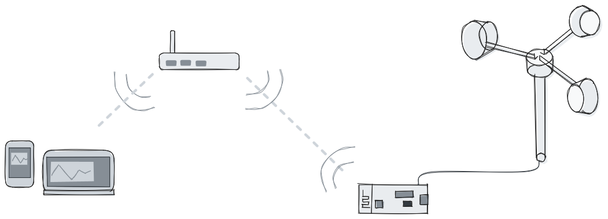
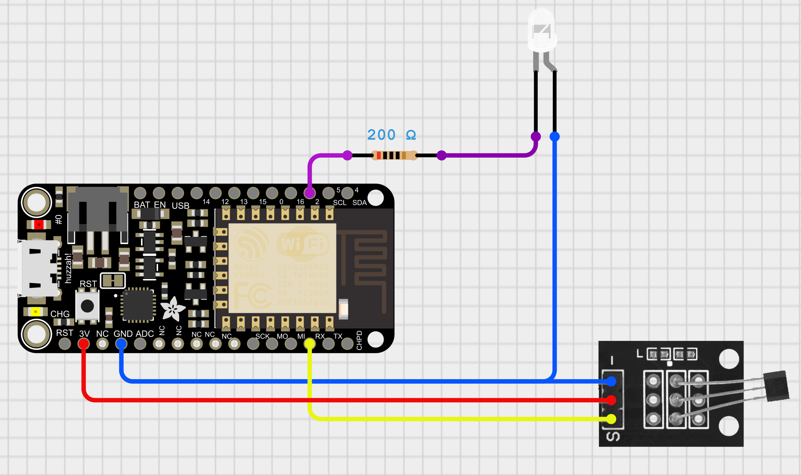
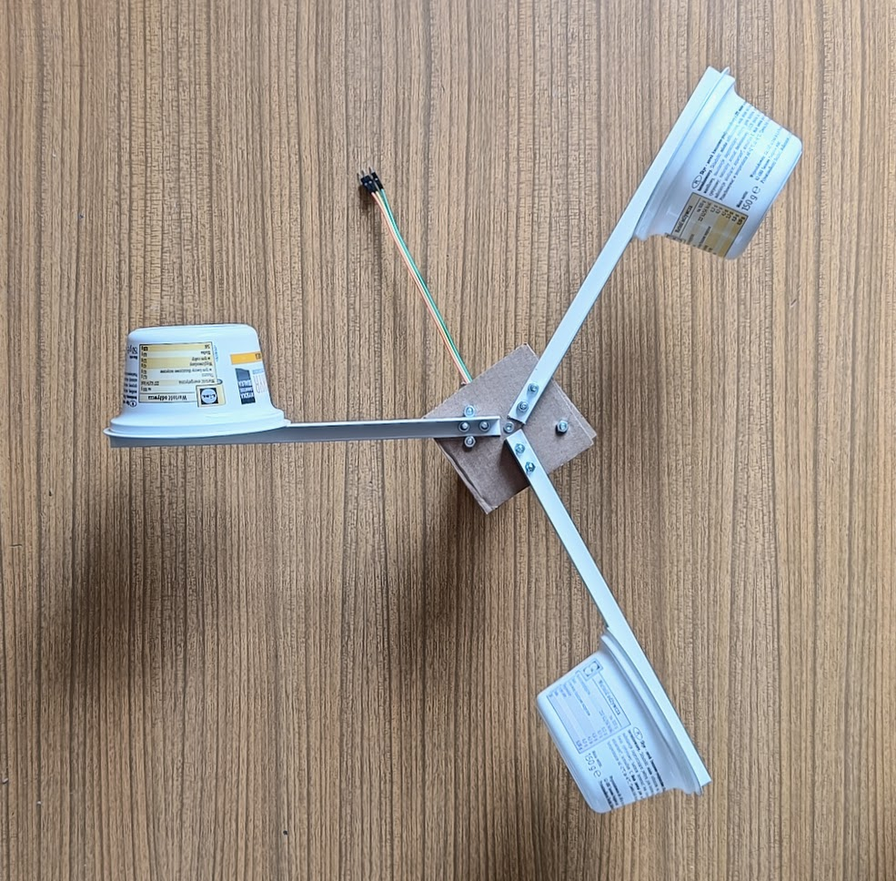
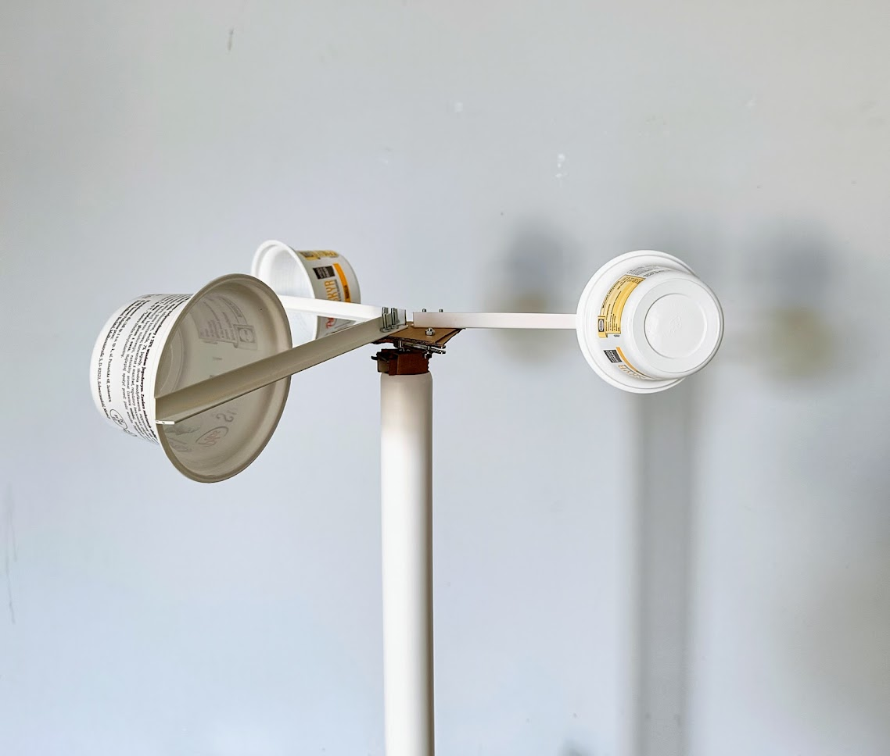
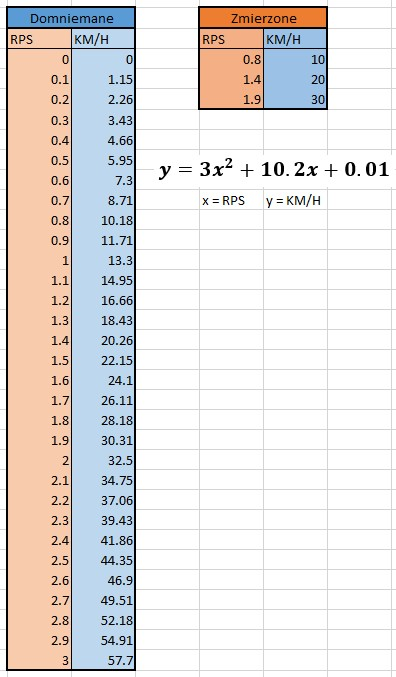
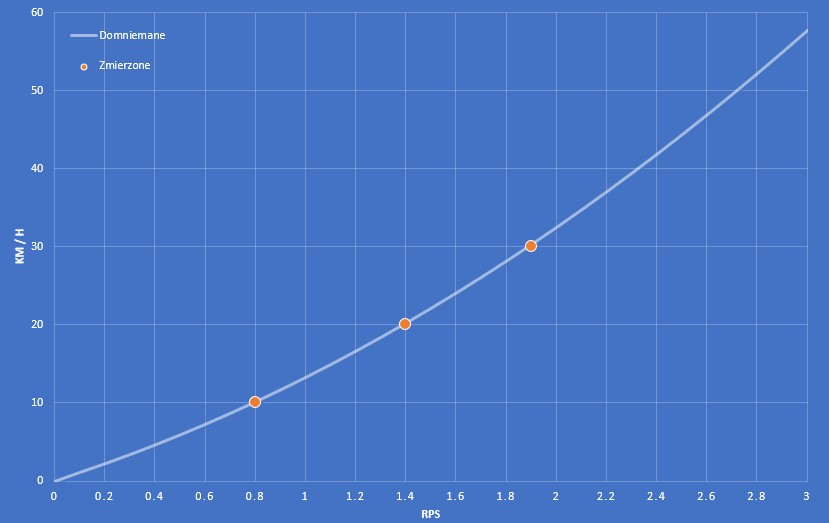
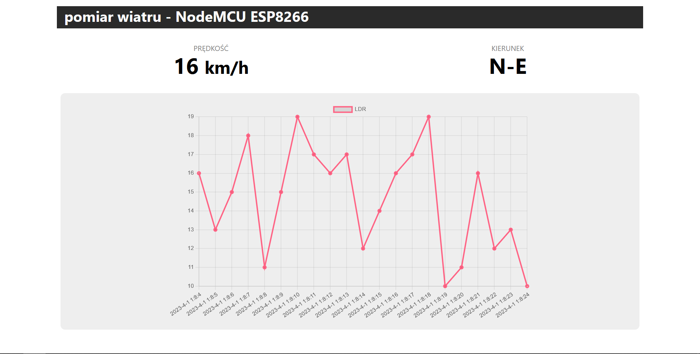

# Anemometr


Stacja mierząca prędkość wiatru oparta o płytkę ESP8266 i interfejs web wyświetlający na bieżąco wyniki pomiarów.
Projekt zespołowy został wykonany w ramach zajęć na kierunku Informatyka Przemysłowa na Filii JG Politechniki Wrocławskiej.

## Platforma
Moduł ESP8266 NodeMCU v2 został wybrany ze względu na:
- łączność z WiFi
- niską cenę układu ESP8266
- wbudowany konwerter UART - USB
- możliwość użycia bibliotek Arduino

## Środowisko
Płytkę ESP8266 można zaprogramować za pomocą Arduino IDE. Niestety nowsze wersje tego środowiska (v2+) są niekompatybilne z wieloma istniejącymi bibliotekami. W związku z tym projekt zbudowaliśmy za pomocą dedykowanego mikroprocesorom środowiska PlatformIO instalowanego jako wtyczka do Visual Studio Code.

### Instalacja
Żeby uruchomić PlatformIO IDE trzeba zainstalować:
- [pythona](https://www.python.org/downloads/) w wersji co najmniej 3.6
- środowisko [VS Code](https://code.visualstudio.com/download)
- wtyczkę [Platform IO](https://docs.platformio.org/en/latest/integration/ide/vscode.html#ide-vscode)

### Konfiguracja sieci WiFi

Stacja łączy się ze statycznie zdefiniowaną siecią wifi. Id i hasło sieci zmienia się przez zmienne:
```cpp
// main.cpp
const char *ssid = "network_name";
const char *password = "wifi_password";
```

### System plików
Projekt używa systemu plików `LittleFS` do zapisu danych - plików interfejsu web. 
```cpp
// main.cpp
#include <LittleFS.h>
```
```ini
; platformio.ini
board_build.filesystem = littlefs
```

>Dane pomiarowe nie są zapisywane ze względu na ograniczenia pamięci flash. Przy regularnym zapisywaniu danych (co parę sekund) pamięć przestałaby działać po paru tygodniach.

## Prototyp
<!-- schemat układu -->






## Testy i kalibracja
Testowanie oraz „strojenie” naszego wiatraka odbywało się w następujący sposób.  
Na początek warunki, może i nie były idealne, ale wystarczające. Bezwietrzny i dość ciepły wieczór towarzyszył naszym zmaganiom.  
Następnie, miejsce. Uznaliśmy, że parking pod galerią oraz supermarketem Auchan, będzie idealnym miejscem do przeprowadzenia naszych prób. Pomimo godzin wieczornych, osoby trzecie potrafiły się dość dziwnie na nas patrzeć, aczkolwiek nie powstrzymało nas to przed dokonaniem upragnionych pomiarów.  
Sedno sprawy, sam test. Wystawiliśmy wiatrak za okno mając nadzieję, że prędkość nie będzie na tyle duża, aby porwać go z naszych rąk. Następnie z precyzją szwajcarskiego zegarka jechaliśmy prawie pustym parkingiem na wskroś, samochodem marki Audi, biorąc szczególnie pod uwagę prędkości przez nas wyznaczone: 10, 20 oraz 30 kilometrów na godzinę, dającymi nam możliwość wystrojenia wiatraka, i zapisywaliśmy wszystkie zebrane dane.

Wyniki jakie uzyskaliśmy prezentują się następująco:
<!-- zebrane dane -->



## Interfejs web

